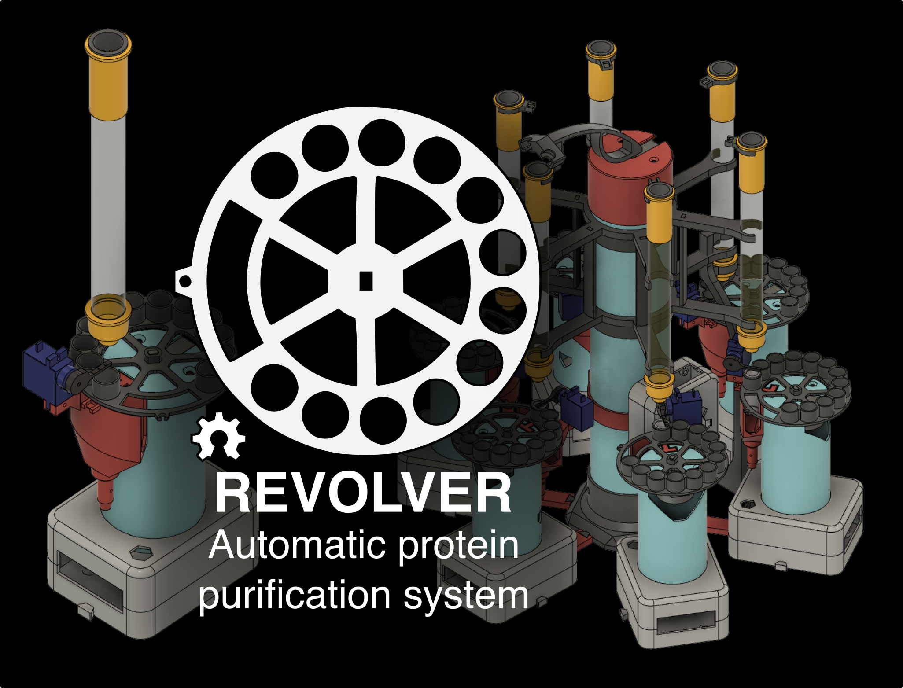

# REVOLVER: An automated protein purification system

  

This repository contains all the hardware and firmware files to build and operate REVOLVER: an automated protein purifier based on paralleled large-scale gravity-column workflows. We also present MULTIVOLVER, a multiplexed version of REVOLVER that allows for simultaneous purification of up to six samples at a time.

REVOLVER was developed by Patrick Diep and Jose L. Cadavid at the University of Toronto. A full and detailed description of our system can be found in [this preprint](https://www.biorxiv.org/content/10.1101/2021.12.12.472287v1).

## Contents of repository

This repository contains all files necessary to print, build, and operate REVOLVER. It is divided in three main sections:

### Electronics

This folder contains the schematics for wiring the components of REVOLVER to an Arduino Nano board. This schematic was used to create a custom PCB using [EasyEDA](https://easyeda.com/) that was then ordered through [JLCPCB](https://jlcpcb.com/). The PCB file is included as a Gerber file that can be used to directly order a copy of the PCB (two PCBs fit a 10x10 cm panel). We additionally include a .json version of the PCB that can be opened with EasyEDA.

The raw PCB project can be accessed through [OSHWLab](https://oshwlab.com/JoseLCadavid/fractioncollector). If you would like to make your own PCB, please clone the project first and proceed with your improvements. Our current PCB corresponds to V2 in the project page.

### Firmware

This folder contains the Arduino firmware for configuring REVOLVER in single mode (single_sampler) or in MULTI-VOLVER mode (distributor_device and revolver_device). To upload (flash) the firmware to an Arduino board, you'll need a recent version of the Arduino IDE that can be found [here](https://www.arduino.cc/en/software). You can follow [this](https://www.arduino.cc/en/Tutorial/getting-started-with-ide-v2/ide-v2-uploading-a-sketch) tutorial on how to upload the firmware.

REVOLVER uses code and libraries written by other users and we would like to acknowledge them here:

* Serial communication and parser: This routine is based on [this](https://forum.arduino.cc/t/serial-input-basics-updated/382007/8) excellent tutorial by user **Robin2** on the Arduino forums.

* I2C bus scanner: This function is based on [this](https://playground.arduino.cc/Main/I2cScanner/) code.

Additionally, our code relies on these libraries:

* [Stepper](https://www.arduino.cc/en/reference/stepper/): For controlling stepper motors.
* [Servo](https://www.arduino.cc/reference/en/libraries/servo/): For controlling servos.
* [Wire](https://www.arduino.cc/en/reference/wire): For handling I2C communication.

Please verify that your Arduino IDE has access to these libraries before uploading the firmware to the Arduino boards. You can follow [this](https://www.arduino.cc/en/Guide/Libraries) tutorial for more information on how to do so. Detailed instructions on operating REVOLVER can be found in our manuscript.

### Hardware

This folder contains the STL files for all the 3D-printed parts required for REVOLVER and MULTI-VOLVER. These parts can be printed with no supports using any FDM printer with a size similar to that of an Ender 3; we've printed all our parts in PLA. We also included the f3d files that can be edited using Fusion 360 in case you'd like to customize the system even more. The bill of materials (BOM) is also included as a spreadsheet with some useful links to purchase parts.

## Building and using REVOLVER

The instructions for setting up and using REVOLVER are given in more detail in our manuscript (link coming soon). REVOLVER is controlled via serial commands, so any computer with a working USB connector and an installation of the Arduino IDE is required.

If you experience any issues when using our system, or otherwise have other suggestions, please create and issue and we are happy to help as soon as we can. Note that our manuscript includes a guide to troubleshooting common problems, so please check it out before posting.
